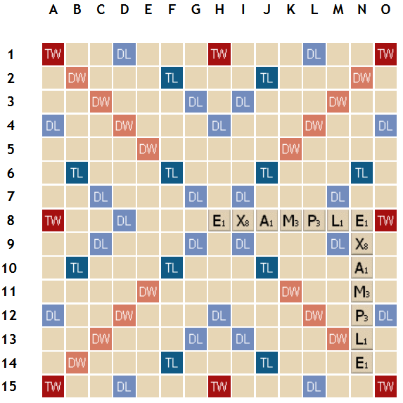

# Unscrabbler API

## Overview

Returns a list of scrabble words you can make with a given set of letters.
It also supports optionally filtering based on a regular expression.

The dictionary used is the `enable1.txt` dictionary (Words With Friends).

## Example Usage

If your rack is:

`D, G, L, O, O, Y, Z`

Then you can retrieve all possible words with:

Request `POST /unscrabble?rack=dglooyz`:

Response:

    {
      "results": [
        "do",
        "dog",
        "dogy",
        "dol",
        "dooly",
        "doozy",
        "dozy",
        "go",
        "god",
        "godly",
        "gold",
        "goo",
        "good",
        "goodly",
        "goody",
        "goy",
        "lo",
        "log",
        "logo",
        "logy",
        "loo",
        "od",
        "odyl",
        "old",
        "oldy",
        "ology",
        "oozy",
        "oy",
        "yo",
        "yod",
        "zoo"
      ]
    }

## Filtering with a regex

Filtering with a regex is useful in many cases.

For example, say your board is so:

And your rack is:

`A, H, P, S, T, Y, Z`

You know you can use `S` at N15 to make the word `EXAMPLES`, and you want to reach the triple word bonus to the right, which is on the edge of the board. You could use the regex `s.$` to filter words that will fit:

Request `POST /unscrabble` with body:

    {
      "rack": "ahpstyz",
      "regex": "s.$"
    }

Response:

    {
      "results": [
        "ash",
        "asp",
        "hasp",
        "hast",
        "pash",
        "past",
        "patsy",
        "sh"
      ]
    }

## TODO

- Improve speed (trie? directed graph? caching?)
- Version the API
- Add authentication (OAuth?)
- Calculate word scores for each result
- Support multiple dictionaries

